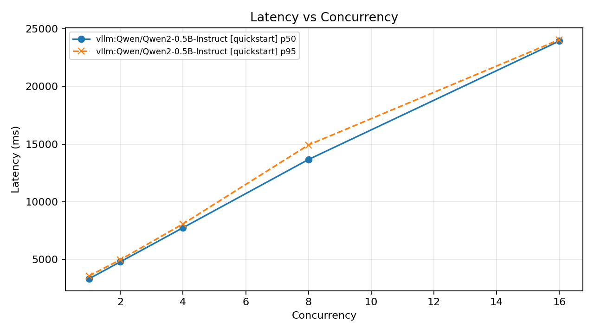

# llm-inference-bench

[](https://github.com/noahlundsyrdal/llm-inference-bench/actions/workflows/ci.yml)

A small, credible MVP for benchmarking **local vLLM inference** with reproducible configs and clean outputs.


## Why this exists

ML infra engineers usually need quick, reproducible answers to:
- how latency changes as concurrency increases,
- where tail latency and errors start to spike,
- whether a serving change caused a real regression.

`llm-inference-bench` gives a minimal, repeatable way to answer those questions locally with vLLM.

## Scope (MVP)

- vLLM OpenAI-compatible endpoint (`/v1/chat/completions`)
- YAML run configs
- Async benchmark runner with bounded concurrency
- Per-request raw logs + aggregated metrics
- PNG plots + markdown summary report
- One-command local first run path

What is deliberately out of scope for this MVP:
- multi-engine adapter matrix
- advanced experiment orchestration
- cluster/GPU telemetry pipelines

## 30-second quickstart

```bash
python3 -m venv .venv
source .venv/bin/activate
make install
pip install vllm
make serve
make check
make bench
```

To run **without Hugging Face login** (e.g. CI or first try), use the public-model config: start the server with `make serve VLLM_MODEL=Qwen/Qwen2-0.5B-Instruct`, then `make check CONFIG=configs/local_vllm_public.yaml` and `make bench CONFIG=configs/local_vllm_public.yaml`. The default `meta-llama/Llama-3.1-8B-Instruct` is gated and requires `huggingface-cli login` and model access.

## Quickstart (step-by-step)

### 1) Install

```bash
python3 -m venv .venv
source .venv/bin/activate
pip install -e '.[dev]'
```

### 2) Start vLLM server

The Makefile provides an OpenAI-compatible server on port 8000 (API under `/v1`):

```bash
pip install vllm   # if not already installed (e.g. in .venv)
make serve
```

This runs `vllm serve <model>` with the default model. To use a **public model** (no Hugging Face login), e.g. for CI or quick verification:

```bash
make serve VLLM_MODEL=Qwen/Qwen2-0.5B-Instruct
```

The default `meta-llama/Llama-3.1-8B-Instruct` is gated; use `huggingface-cli login` and accept the model terms if you use it.

### 3) Validate endpoint/model visibility

```bash
make check
# or with the public config (matches Qwen2-0.5B above):
make check CONFIG=configs/local_vllm_public.yaml
```

### 4) Run benchmark

```bash
make bench
# or: make bench CONFIG=configs/local_vllm_public.yaml
```

## First benchmark results (evidence)

Command used (vLLM serving Qwen2-0.5B-Instruct locally, public config):

```bash
make serve VLLM_MODEL=Qwen/Qwen2-0.5B-Instruct
make bench CONFIG=configs/local_vllm_public.yaml
```

Artifacts are under `results/qwen2-0.5b-local-first-run/` (raw logs, aggregated CSV, plots, summary, config snapshot).

**Finding:** Latency rose steadily with concurrency (p50 from ~3.3s at concurrency 1 to ~24s at 16), while throughput fell from ~29 to ~5 tok/s. The single-worker local server saturates quickly: higher concurrency did not improve throughput, only increased queueing and per-request latency.



## Sample output

A run creates `outputs/<run_name>_<timestamp>/` (or your configured `output_dir`) with files like:

```text
raw_requests.jsonl
raw_requests.csv
aggregated.csv
failures.csv
summary.md
run_metadata.json
config_snapshot.yaml
latency_vs_concurrency.png
throughput_vs_concurrency.png
ttft_vs_concurrency.png
error_rate_vs_concurrency.png
```

## Output artifacts

Each run creates `outputs/<run_name>_<timestamp>/` with:
- `raw_requests.jsonl`
- `raw_requests.csv`
- `aggregated.csv`
- `failures.csv`
- `summary.md`
- `run_metadata.json`
- `config_snapshot.yaml`
- `latency_vs_concurrency.png`
- `throughput_vs_concurrency.png`
- `ttft_vs_concurrency.png`
- `error_rate_vs_concurrency.png`

## Config example

See [`configs/local_vllm.yaml`](configs/local_vllm.yaml) (default; uses gated Llama) and [`configs/local_vllm_public.yaml`](configs/local_vllm_public.yaml) (public model, no Hugging Face login).

Key fields:
- `backend.base_url`: your vLLM server URL
- `backend.model`: model name exposed by `/v1/models`
- `generation.stream`: set `true` to capture TTFT
- `workload.prompts_file`: prompt dataset path
- `concurrency_sweep`: load levels to benchmark

## CLI

- `llmbench check <config.yaml>`: fail fast if vLLM is unreachable or model name is wrong.
- `llmbench run <config.yaml>`: execute benchmark and generate all artifacts.

## Makefile targets

- `make install` — install the package and dev deps (use a venv; the Makefile will use `.venv/bin/python` when present)
- `make serve` — start local vLLM OpenAI-compatible server on port 8000 (`/v1`). Override model with `VLLM_MODEL`, e.g. `make serve VLLM_MODEL=Qwen/Qwen2-0.5B-Instruct`
- `make check` — verify vLLM is reachable and the configured model is visible. Config: `CONFIG=configs/local_vllm.yaml` (default) or `configs/local_vllm_public.yaml` for the public model
- `make bench` — run benchmark and write artifacts to `output_dir`
- `make lint`
- `make test`

## Tests

```bash
ruff check src tests
pytest -q
```

## Roadmap (after MVP)

- TGI adapter
- SGLang adapter
- `compare` command for run-vs-run regression diffs
- GPU utilization capture
- issue template export for upstream bug reports
